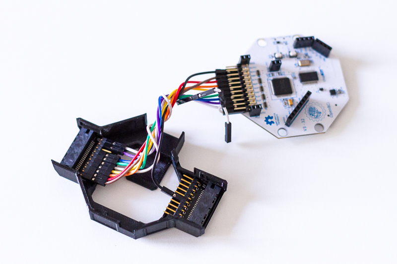
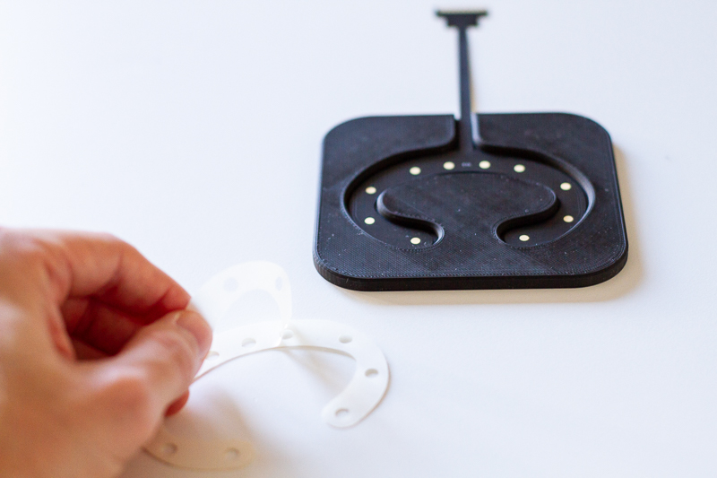
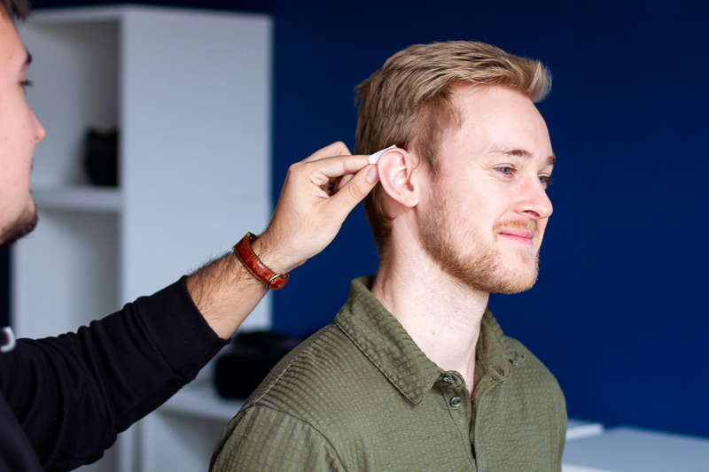
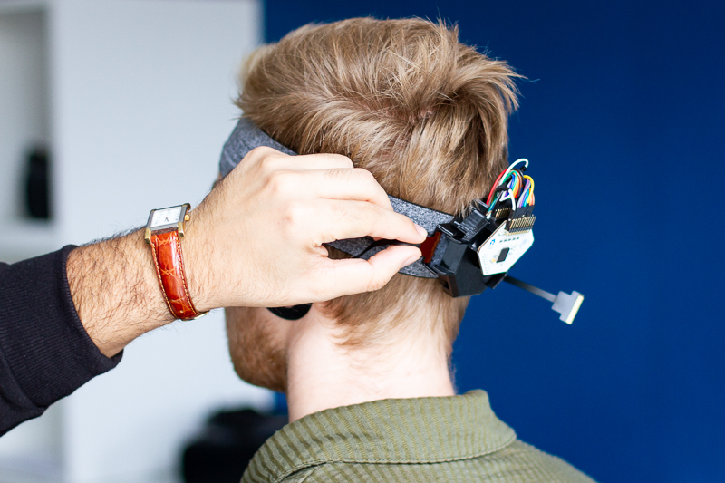

# openbci-ceegrids
Collecting brain signals from the ear - affordably and reliably with gelled around-the-ear EEG electrodes (cEEGrids) and the OpenBCI ExG biosignal amplification system.

This repository contains the materials and documentation of this cEEGrid adapter for the use with the OpenBCI Cyton + Daisy boards. 

  

 

 

## Version Updates

This fourth version of the OpenBCI cEEGrid Adapter features:

- **Better Battery Access & Storage:** by taking away the bottom coverage slightly, users can more easily (dis-) connect a battery for charging.
- **Sturdier Body:** By improving tolerances, wall thickness and locking mechanisms, the cover is now much stronger.
- **Better Usability with Baseball Caps:** Through a re-design of the bottom clip, the system can now be used with baseball caps and headbands more easily and reliably.

- The initial technical evaluation of the system has been published in the journal [Brain-Computer Interfaces in 2021](https://doi.org/10.1080/2326263X.2021.1972633)
- For the documentation of the cEEGrid development please refer to the [cEEGrid developers website](https://uol.de/psychologie/abteilungen/ceegrid) or the publication by [Debener et al. 2015](https://www.nature.com/articles/srep16743).
- The project is part of the [KIT Earables Community](https://earables.teco.edu/)
- We will keep making all the materials and documentation available. To make the system more readily available, we also offer to source the materials for you. So if you'd like to save some time, just check out [this website](https://exgtools.expeeeriments.io/).

<a href="https://exgtools.expeeeriments.io/" target="_blank">
	
</a>

<a href="https://exgtools.expeeeriments.io/" target="_blank">
	
</a>

------

## Materials

| Amount | Part   Description                                                  | Instance /   Reference                                                                                               |
|--------|---------------------------------------------------------------------|----------------------------------------------------------------------------------------------------------------------|
| 1      | OpenBCI Cyton Board + Daisy Shield   (Biosignal Acquisition Boards) | Available from <a href="https://shop.openbci.com/collections/frontpage/products/cyton-daisy-biosensing-boards-16-channel?variant=38959256526" target="_blank">OpenBCI</a>              |
| 2      | cEEGrid Electrodes                                                  | Gold-Plated cEEGrids from <a href="https://exgtools.expeeeriments.io/" target="_blank">us</a> or Silver/Silver-Chloride cEEGrids through <a>sales@tmsi.com</a>; Check <a href="https://doi.org/10.1002/nano.202100345" target="_blank">Kurniawan et al. 2022</a> for a material comparison                                          |
| 1      | cEEGrid Sticker Applicator Form                              	   | Custom [3D-Print Files](./stl/) available in this repository                   |
| 2      | Printed   Circuit Boards                                            | Custom [PCB File](./pcb/) available in this repository; Can be manufactured on demand, e.g. at   https://aisler.net/                                                                                                                                                                 |
| 1      | Re-designed Cyton + Daisy Board Mounts                              | Custom [3D-Print Files](./stl/) available in this repository                   |
| 2      | Mini Edge Card Socket                                               | SAMTEC MB1-120-01-L-S-01-SL-N –   configurable at https://www.samtec.com/products/mb1                                |
| 20     | Pin Headers                                                         | Here we used a 10-pin angled SMD header, with 2.54 inch pitch, e.g. available from Harwin Inc. (MPN: M20-8891045) |
| 20     | Jumper Cables                                                       | Here we used short (3 inch) female/female jumper wires, e.g. available at   https://www.adafruit.com/product/1951  |
| 1      | Lithium Ion Polymer Battery - 3.7v 500mAh (JST-PH Connector)        | Available for example at: https://www.adafruit.com/product/1578 |

------

## Assembly & Use Instructions
The kit is comprised of three main components: (1) The OpenBCI Cyton microcontroller with the Daisy 
shield that enables the low-cost mobile biosignal acquisition (e.g. EEG, ECG, or EMG), (2) the cEEGrid electrodes, a set 
of flex-printed electrodes in a c-shaped form that can be placed around a person’s ear using adhesives, and 
(3) the printed circuit board (PCB) that transmits the signal from the applied cEEGrids to an amplifier (the adapter).

### Manufacturing the Components
To produce the plastic components (bottom and top board covers and cEEGrid sticker applicator - [3D-Print Files](./stl/)), FDM 3D-printing can be used 
with a standard 0.4 mm nozzle diameter and 0.2 mm layer height. Rather slow print speeds (e.g. 40 mm/s) should be used as the parts have fine details.

To assemble a cEEGrid adapter PCB, three parts are required, a contact point that connects to the cEEGrid pins (2mm pitch – 
used here is a mini edge card socket by the company SAMTEC), a PCB, and a set of male  or female pin headers with 2.54mm pitch 
(10 pins, single row). The parts can be joined using a soldering iron. To facilitate the soldering of the mini edge card socket 
to the PCB and to lower the risk of bridges it is recommended that every second pin (but starting with the first pin) of the card 
socket is removed before assembling the connector. Extensive instructions for this assembly and for the use of the cEEGrids are 
provided by the cEEGrid developers at: https://uol.de/neuropsychologie/howtoconnect.


### Assembly of the Kit
#### Channel Selection
Before you get started with the assembly, you need to decide which cEEGrid electrodes you want to use in your recording.
Each cEEGrid electrode comes with 10 electrodes (so 20 in total on both ears), but the OpenBCI Cyton+Daisy can only record from
up to 16 channels (+ REF & GND electrodes). Therefore, you need to decide which electrodes to use. For starters, we recommend 
the following default layout that provides fairly even coverage by excluding channel L3 & R3, and using channel L6 as REF and R6 as GND. 
A similar configuration was used in the validation study in [Brain-Computer Interfaces in 2021](https://doi.org/10.1080/2326263X.2021.1972633) for the cEEGrid OpenBCI combination.
If you want to highlight the configuration that you used in a publication, you may use the [PowerPoint](./res/) from this repository for a figure.

#### Connecting the Adapter PCB
The figure below shows how you should route the jumper cables from the adapter PCB to the Cyton+Daisy boards for the configuration mentioned above.


We recommend connecting the left ear to the Cyton pins (channel 1-8 in the OpenBCI GUI) and the right ear 
to the Daisy pins (channel 9-16 in the OpenBCI GUI). We also recommend maintaining the colour coding to keep 
track of which electrodes are being used and which are left out (see a screenshot of the OpenBCI GUI below.

Start by placing the connector PCBs in their respective slots. Gently pull on the edges of these slots to allow the PCBs to slide in.


Then connect the jumper cables. Make sure to route the jumper wires in a way that the cables will run below the Cyton board (not above it).
To set REF & GND, connect the designated electrodes/pins (here R4a and R4b) to the bottom SRB (for REF) and bottom BIAS (for GND) pins on the Cyton. Beware that the Cyton and Daisy boards need to be connected using a y-splitter cable that comes with the Cyton+Daisy kit (or can be purchased in the OpenBCI shop at: https://shop.openbci.com/products/y-splitter-cable).
This is the default setup for the Cyton+Daisy to collect EEG data (see also: https://docs.openbci.com/GettingStarted/Biosensing-Setups/EEGSetup/)

 

Next, put the top enclosure on and stack the Daisy on top of the Cyton board. 
 

Almost there now, you just need to add a battery.

#### Connecting the Battery
As a power supply, use a 400 or 500mAh lithium-ion rechargeable battery pack. Simply plug the battery into the JST-PH connector that is accesible from the bottom of the case. Then, stow away the battery in the case by sliding it in through the large opening on the bottom cover. 

 

Voilà, you are set up, attach to your hat and get recording!

#### Wearing Solution
Attach the system to your preferred mounting solution (a headband, cap, hat, VR lenses, or similar) and start your recording. For laboratory recordings we recommend using a simple headband. Here, especially a thin one works perfectly and does not produce a warming sensation. For field settings, we recommend using a baseball cap to blend more naturally in everyday situations.

 

### Setting up a Recording
Haven't used cEEGrids before? No problem, we got you covered with the use instructions below. 

Important note: We are using gold-plated cEEGrids whereas the original cEEGrids used an Ag/AgCl plating that is commonly used in EEG systems. The use and design is otherwise exactly the same, so you can also decide which ones to use.

 

Worried about the recording suitability? Recent research (https://doi.org/10.1002/nano.202100345) highlights lower impedance of gold (Au) electrodes in the 1-1000Hz region than Ag/AgCl (but higher impedances <1Hz). So, for most EEG and EMG recordings, these gold-plated electrodes are a fantastic alternative!

#### Attaching cEEGrids
Ok, so now that you have your kit set up and are ready to conduct a recording, you need to prepare and apply the cEEGrid electrodes. Here, we are following the instructions by the cEEGrid developers (see: https://uol.de/neuropsychologie/howtouse). They have also produced a set of video instructions: https://uol.de/en/psychology/neurophysiology/resources/ceegrid-video-tutorial. For completeness, we detail the cEEGrid application steps here as well. 

In a first step, make sure you have two cEEGrids ready. That means, you should attach a new set of stickers with the help of the sticker applicator. Make sure, to attach the sticker on the correct side (the side where the gold pads are exposed). Place the cEEGrid in the applicator form, remove the liner on one side of the sticker and attach it from the outside inwards. Make sure that the holes are leaving the electrode pads uncovered.

 

Next, take off the other side of the sticker and leave the electrode lying on a table with the adhesive exposed. We prefer adding the gel after this step to not accidentally remove it when taking off the sticker liner afterwards. Add a lentil-sized amount of electrolyte to each individual electrode pad using the syringe. We use Abrasiv Plus from OneStep, but other electrolytes should work as well.

 

Now, get the participant's skin ready and apply the electrode. It is recommended to clean the skin around the ear with an alcohol pad to remove oily residues that can lower the signal-to-noise ratio (SNR) of your recordings due to higher impedances at the electrode-skin interface. Ask the participant to keep hair away from the ear and gently apply the cEEGrid. The grid is perfectly positioned when it is not touching the pinna (outer-ear).

 

Plug in the cEEGrids (gold plates facing towards the head) into the edge card sockets and you are ready to start recording! 

 

#### Starting a Recording
To start a recording, open OpenBCI GUI with the 16 channel configuration and connect the Cyton+Daisy boards. You can click "Start Data Stream" to see the signals coming in. Before you record the data, you should conduct some initial signal quality checks. 

As a first indicator, you will see, if all channels are showing similar signals and amplitudes. As the cEEGrid electrodes are close to each other, the signals will be similar (but not exactly the same!). If you see individual flat or heavily fluctuating channels in isolation, these electrode pads might need a bit more gel. If two or more channels next to each other are flat, you probably have accidentally created a gel bridge, shortening the two channels. In that case, you unfortunately have to detach the cEEGrid, clean off the gel, and then re-apply it.

As another signal quality check, you should inspect the channel impedances to get a more accurate SNR metric. Switch to the "Cyton Signal" widget and click the "Check all Channels" button. This checks the impedance on each channel iteratively (see also: https://docs.openbci.com/Software/OpenBCISoftware/GUIDocs/#impedance-testing). Beware that the impedances may take a little while to settle, similarly to cap-based EEG. With good skin cleaning and adequate amount of gel you should be getting impedances between 10 and 50 kOhm.

Ok, and that is it! When you are satisfied with your impedances and signal qualities, click the "Start Data Stream" button again and enjoy collecting cEEGrid data! If you are looking for inspiration, check out some of the documented cases below!


#### Cleaning / Re-using the cEEGrids
If handled properly a cEEGrid can be re-used a few times. After removal from the partcipant, carefully remove the used adhesive sticker. Try to not scratch the electrode pads during removal. Then, clean the grid very gently under running water. Make sure to rinse off all the gel. Do not rub the electrode pads and do not use any chemicals for cleaning. Dry the cleaned cEEGrid gently with a tissue and store it in a dark place, protected from light.

 

------

## Application Examples
### Documented Capabilities
This recording system has been demonstrated to replicate well-known and previously documented neural activity findings (Knierim et al. 2021a). 
Specifically, the former authors documented the blocking of visual input from closing the eyes in occipital brain regions 
(the so-called Berger effect), and the modulation of higher frequency ranges from changes in mental workload. 
These observations have previously been established for the cEEGrid electrodes with other amplifiers (e.g., the MBT Smarting Mobi) (Bleichner & Debener 2017, Debener et al. 2015, Wascher et al 2019). 
In addition, other relatively large amplitude phenomena have been observed with the OpenBCI-cEEGrid system. 
Thereby, the distinctive patterns of various facial muscle activities have been found to be captured and differentiated well (Knierim et al. 2021b, 2021c).

### Use Case: Daytime Bruxism detection
Here, we want to highlight a promising and relevant use case for this system, which is detecting bruxism events. 
Bruxism is the repetitive clenching or grinding of the teeth, a condition associated with multiple physiological and 
psychological health issues, including fractures, erosion of the teeth, headaches, stress, and anxiety. 
Bruxism occurs during the day and the night (sleep bruxism). Even though prevalence for awake bruxism (AB) is relatively 
high among adults (22-30% - compared to sleep bruxism - SB: 1-15%), its detection and intervention have been researched sparsely. 
AB detection challenges are that bruxing events need to be differentiated from a variety of other facial activities and 
that daily recordings need to occur inconspicuously and ergonomically. For this reason, previous work (Knierim et al. 2021c) explored whether 
the cEEGrids can be used with the OpenBCI amplifier as an effective approach to detect bruxing events using machine learning. 
While this previous work reported promising classification performances (F1-Scores of 0.73 to 0.90 for identifying 
posed bruxing events vs. 13 other posed facial activities), it relied on single-session within-subject classification, 
which imposes a central limitation towards generalizability and applicability of the detection approach for real-life 
AB detection. 

Thus, to further explore the utility of the herein reported sensing system, we extended this previous work by a more 
complex, multi-session data collection. One participant completed an experiment three times on three separate days in 
which 28 facial activities were posed (two of which are jaw clenching activities - see the following figure). 
The experimental protocol was highly similar to that reported in (Knierim et al. 2021c).


The recorded signals were labeled according to the corresponding experiment phase and trial (with a shift of 350ms for 
onset/offset of the facial activity per trial). Afterwards, to mimic the process of a live (online) classification system, 
the data were epoched as non-overlapping 1-second windows. An epoch was considered to contain a bruxism event if ≥50% 
of the epoch samples were previously labeled as containing a bruxism episode. Each epoch was then pre-processed using: 
(1) mean-centering of the channel, (2) band-pass filtering (5-62 Hz IIR), and (3) notch filtering (50 Hz IIR). 
Next, a range of features was extracted for each channel and epoch: (1) Hjorth Activity, (2) Hjorth Complexity, 
(3) Hjorth Mobility, (4) Absolute Amplitude Maximum, (5) Absolute Amplitude Sum, (6) Higuchi Fractal Dimension, 
(7) Petrosian Fractal Dimension. Overall, that lead to a dataset of 9944 epochs (first recording = 3350, 
second recording = 3315, third recording = 3279) and 16 (channels) * 7 features = 112 features. Two of the recordings 
were first combined to create a diversified training data set. The third recording was held out as a test data set. 
To optimize the classifier, five-fold stratified cross-validation was performed using the training data. 
SMOTE oversampling was used to deal with the imbalanced distribution of classes. All the features were z-standardized 
and classified with an AdaBoost model. Finally, the model was assessed by predicting the unseen test data from the 
third recording session. This resulted in an F1-Score of 0.73 (Recall: 0.74, Precision: 0.72) for the prediction of 
bruxing events vs all other 26 classes.

These results indicate that, while further improvements can be made, the OpenBCI-cEEGrid recording system appears as a 
viable solution to observe the occurrence of bruxing events. In the spirit of sharing the content of our research, 
the [recorded data and the Python code](./code/) for a simple live bruxism detection system are provided with the article. 

Take a look at this video to see the live biofeedback system in action:

<a href="./video/bruxismDemo.mp4">
	
</a>

------

## Publications
### With this System
- Knierim, M. T., Bleichner, M. G., & Reali, P. (2023). A Systematic Comparison of High-End and Low-Cost EEG Amplifiers for Concealed, Around-the-Ear EEG Recordings. Sensors, 23(9), 4559. https://doi.org/10.3390/s23094559
- Knierim, M.T., Schemmer, M., Bauer, N. (2022)a. A Simplified Design of a cEEGrid Ear-Electrode Adapter for the OpenBCI Biosensing Platform. HardwareX. [e00357] DOI: <a href="https://doi.org/10.1016/j.ohx.2022.e00357" target="_blank">https://doi.org/10.1016/j.ohx.2022.e00357</a>
- Knierim, M. T., Bartholomeyczik, K., Nieken, P., & Weinhardt, C. (2022)b. Could we Predict Flow from Ear-EEG?. In 2022 10th International Conference on Affective Computing and Intelligent Interaction Workshops and Demos (ACIIW) 2022, 1-6. DOI: <a href="https://doi.org/10.1109/ACIIW57231.2022.10086037" target="_blank">https://doi.org/10.1109/ACIIW57231.2022.10086037</a>
- Bartholomeyczik, K., Knierim, M. T., Nieken, P., Seitz, J., Stano, F., & Weinhardt, C. (2022) Flow in Knowledge Work: An Initial Evaluation of Flow Psychophysiology Across Three Cognitive Tasks. Proceedings of the NeuroIS Retreat 2022, 30-41. DOI: <a href="https://doi.org/10.1007/978-3-031-13064-9_3" target="_blank">https://doi.org/10.1007/978-3-031-13064-9_3</a>
- Knierim, M. T., Berger, C., & Reali, P. (2021)a. Open-source concealed EEG data collection for Brain-computer-interfaces - neural observation through OpenBCI amplifiers with around-the-ear cEEGrid electrodes. Brain-Computer Interfaces, 8(4), 161-179. DOI: <a href="https://doi.org/10.1080/2326263X.2021.1972633" target="_blank">https://doi.org/10.1080/2326263X.2021.1972633</a>
- Knierim, M. T., Schemmer, M., & Perusquía-Hernández, M. (2021)b. Exploring the recognition of facial activities through around-the-ear electrode arrays (cEEGrids). Proceedings of the NeuroIS Retreat 2021, 47-55. DOI: <a href="https://doi.org/10.1007/978-3-030-88900-5_6" target="_blank">https://doi.org/10.1007/978-3-030-88900-5_6</a>
- Knierim, M. T., Schemmer, M., & Woehler, D. (2021)c. Detecting Daytime Bruxism Through Convenient and Wearable Around-the-Ear Electrodes. Proceedings of the International Conference on Applied Human Factors and Ergonomics 2021, 26-33. DOI: <a href="https://doi.org/10.1007/978-3-030-80091-8_4" target="_blank">https://doi.org/10.1007/978-3-030-80091-8_4</a>

### With other Amplifiers
- Debener, S., Emkes, R., De Vos, M., and Bleichner, M. (2015). Unobtrusive ambulatory EEG using a smartphone and flexible printed electrodes around the ear. Sci. Rep. 5, 1–11. DOI: <a href="https://doi.org/10.1038/srep16743" target="_blank">https://doi.org/10.1038/srep16743</a>
- Bleichner, M. G., and Debener, S. (2017). Concealed, unobtrusive ear-centered EEG acquisition: Ceegrids for transparent EEG. Front. Hum. Neurosci. 11, 1–14. DOI: <a href="https://doi.org/10.3389/fnhum.2017.00163" target="_blank">https://doi.org/10.3389/fnhum.2017.00163</a>
- Mikkelsen, K. B., Ebajemito, J. K., Bonmati-Carrion, M. A., Santhi, N., Revell, V. L., Atzori, G., della Monica, C., Debener, S. Dijk, D. J., Sterr, A., and de Vos, M. (2019). Machine-learning-derived sleep–wake staging from around-the-ear electroencephalogram outperforms manual scoring and actigraphy. J. Sleep Res. 28, 2. DOI: <a href="https://doi.org/10.1111/jsr.12786" target="_blank">https://doi.org/10.1111/jsr.12786</a>
- Sterr A., Ebajemito, J. K., Mikkelsen, K. B., Bonmati-Carrion, M. A., Santhi, N., della Monica, C., Grainger, L., Atzori, G., Revell, V., Debener, S., Dijk, D. J., De Vos, M. (2018). Sleep EEG derived from behind- the-ear electrodes (cEEGrid) compared to standard polysomnography: A proof of concept study. Front. Hum. Neurosci. 12, 1–9. DOI: <a href="https://doi.org/10.3389/fnhum.2018.00452" target="_blank">https://doi.org/10.3389/fnhum.2018.00452</a>
- Wascher, E., Arnau, S., Reiser, J. E., Rudinger, G., Karthaus, M., Rinkenauer, G., Dreger, F., and Getzmann, S. (2019). Evaluating Mental Load During Realistic Driving Simulations by Means of Round the Ear Electrodes. Front. Neurosci. 13, 1–11. DOI: <a href="https://doi.org/10.3389/fnins.2019.00940" target="_blank">https://doi.org/10.3389/fnins.2019.00940</a>
- Getzmann, S., Reiser, J. E., Karthaus, M., Rudinger, G., & Wascher, E. (2021). Measuring correlates of mental workload during simulated driving using ceegrid electrodes: a test–retest reliability analysis. Frontiers in neuroergonomics, 2, 729197. <a href="https://doi.org/10.3389/fnrgo.2021.729197" target="_blank">https://doi.org/10.3389/fnrgo.2021.729197</a>
- Garrett, M., Debener, S., & Verhulst, S. (2019). Acquisition of subcortical auditory potentials with around-the-ear cEEGrid technology in normal and hearing impaired listeners. Frontiers in neuroscience, 13, 730. DOI: <a href="https://doi.org/10.3389/fnins.2019.00730" target="_blank">https://doi.org/10.3389/fnins.2019.00730</a>
- Jaeger, M., Mirkovic, B., Bleichner, M. G., & Debener, S. (2020). Decoding the attended speaker from EEG using adaptive evaluation intervals captures fluctuations in attentional listening. Frontiers in Neuroscience, 14, 603. DOI: <a href="https://doi.org/10.3389/fnins.2020.00603" target="_blank">https://doi.org/10.3389/fnins.2020.00603</a>
- Mirkovic, B., Bleichner, M. G., De Vos, M., & Debener, S. (2016). Target speaker detection with concealed EEG around the ear. Frontiers in neuroscience, 10, 349. DOI: <a href="https://doi.org/10.3389/fnins.2016.00349" target="_blank">https://doi.org/10.3389/fnins.2016.00349</a>
- Nogueira, W., Dolhopiatenko, H., Schierholz, I., Büchner, A., Mirkovic, B., Bleichner, M. G., & Debener, S. (2019). Decoding selective attention in normal hearing listeners and bilateral cochlear implant users with concealed ear EEG. Frontiers in neuroscience, 13, 720. DOI: <a href="https://doi.org/10.3389/fnins.2019.00720" target="_blank">https://doi.org/10.3389/fnins.2019.00720</a>

### Citation
```bib
@article{10.1080/2326263X.2021.1972633,
  title={Open-source concealed EEG data collection for Brain-computer-interfaces-neural observation through OpenBCI amplifiers with around-the-ear cEEGrid electrodes},
  author={Knierim, Michael Thomas and Berger, Christoph and Reali, Pierluigi},
  journal={Brain-Computer Interfaces},
  volume={8},
  number={4},
  pages={161--179},
  year={2021},
  publisher={Taylor \& Francis}
}
```